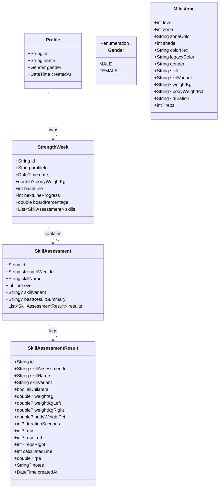

# Architecture Specification

This document details the software architecture, domain model, cloud synchronization protocol, and extensible interfaces for the **Prevail** application.

---

## 1. High-Level Architecture Overview

Prevail is built around a **Local-First, Serverless Architecture**. The local device is the authoritative source of immediate state, and Google Drive's hidden `appDataFolder` acts as the cloud backup and synchronization layer.

```
┌────────────────────────────────────────────────────────────────────────┐
│                          Presentation Layer                            │
│  (StrengthWeekList, StrengthWeekDetail, SkillAssessment, Settings, etc.)│
└───────────────────────────────────┬────────────────────────────────────┘
                                    │ Watches / Triggers
                                    ▼
┌────────────────────────────────────────────────────────────────────────┐
│                   Domain Layer (Pure Dart / Business Logic)            │
│  • Use Cases (CalculateBaseLine, MatchMilestoneLine, SyncDrive)        │
│  • Entities: Profile, StrengthWeek, SkillAssessment, Milestone         │
│  • Repository Interfaces: IAssessmentRepository, IProfileRepository    │
└───────────────────────────────────┬────────────────────────────────────┘
                                    │ Implements
                                    ▼
┌────────────────────────────────────────────────────────────────────────┐
│                               Data Layer                               │
│  ┌─────────────────────────┐          ┌─────────────────────────────┐  │
│  │ Local Cache (Drift/SQL) │ ◄──────► │ Google Drive AppData Remote │  │
│  └─────────────────────────┘   Sync   └─────────────────────────────┘  │
│               ▲                                                        │
│               │ Bundled on build                                       │
│  ┌─────────────────────────┐                                           │
│  │ Milestones JSON Asset   │                                           │
│  └─────────────────────────┘                                           │
└────────────────────────────────────────────────────────────────────────┘
```

---

## 2. Domain Model & Entities



---

## 3. Mathematical Calculations & Progression Rules

### A. Strength Week Metrics
For a given `StrengthWeek` with $N$ skills ($N = 12$ canonical skills, where `PULLUP` is the standard name):

1. **Base Line ($L_{base}$):**
   * Evaluated across all 12 skills.
   * **Inferred Carry-Forward Rule:** If a skill has not yet been attempted in the current Strength Week:
     * If a prior assessment exists for that skill, carry forward the prior assessment's line level. Mark the value as **inferred** in the UI (e.g. `11*` or `(11)`).
     * If no prior assessment exists for that skill (e.g., initial profile onboarding), ignore the unattempted skill from the minimum calculation.
   * Formula:
     $$L_{base} = \min_{i \in \text{Available Skills}} (\text{Line}_i)$$

2. **Next Line Progress ($P_{next}$):**
   $$P_{next} = \sum_{i \in \text{Available Skills}} \begin{cases} 1 & \text{if } \text{Line}_i > L_{base} \\ 0 & \text{otherwise} \end{cases}$$
   Represents how many skills are currently building toward the next overall tier above the base line.

3. **Board Percentage ($B\%$):**
   * Missing or unattempted skills in the current week contribute **0** to the numerator.
   * Total is always divided by the full board maximum score ($12 \times 20 = 240$):
     $$B\% = \frac{\sum_{i=1}^{12} \text{Achieved Current Line}_i}{240} \times 100\%$$

### B. Best Result Selection Precedence
When multiple attempts are logged for a skill in an assessment week, the **Best Result** is selected using the following strict priority cascade:
1. **Line Level:** Highest milestone line achieved.
2. **Weight / Load:** Higher load lifted (kg/lbs).
3. **Reps:** Higher repetition count.
4. **Duration:** Longer hold / time under tension.
5. **Recency:** Most recent attempt if all metrics are identical.

### C. Body Weight & Load Calculation
* **Units:** User may enter body weight in **lbs** or **kg** (app persists the preferred display unit per profile).
* **Target Load Precision:** Milestone body weight percentage targets ($\text{Target} = \text{Body Weight} \times \% \text{BW}$) are calculated with **exact unrounded precision** (e.g., $185\text{ lbs} \times 75\% = 138.75\text{ lbs}$).
* **Actual Weight Entry:** Users record the actual physical weight lifted (which commonly rounds up slightly to match available barbell plates or kettlebells).
* **Qualification:** To achieve a milestone tier, the logged attempt must **meet or exceed all required criteria** for that line. If any criterion is not met, the engine steps down to the highest tier where all criteria are satisfied.
* **Unilateral Movement Qualification Rule:** For one-arm or one-leg variants (Get-Up, Carry, One-Arm Pushup, Pistol, Split Squat, Press), **both left and right sides must meet or exceed** the tier's standard:
  $$\text{Line Achieved} = \min(\text{Line}_{\text{Left}}, \text{Line}_{\text{Right}})$$

---

## 4. Serverless Cloud Storage Protocol & Offline-First Merge

### A. Offline-First Guest Mode & Persistence
* **Zero-Setup Startup:** The app works fully offline immediately upon first installation without requiring a Google account.
* **Session Memory:** The app stores the `activeProfileId` locally in preferences/Drift. On each launch, the last used profile is restored automatically without prompting.
* **Local Multi-Profile:** Users can create multiple profiles and log assessment data completely on-device.

### B. Late Google Account Connection & Merge Strategy
When a user connects a Google account in the Settings screen after already using the app locally:
1. **Cloud Fetch:** Query Google Drive `drive.appdata` space for existing `profiles.json` and associated `strength_weeks_*.json` files.
2. **Profile Merge:**
   * Local profiles whose IDs exist in remote: Merge metadata (latest timestamp wins).
   * Local profiles not in remote: Add to the remote profiles manifest.
   * Remote profiles not locally present: Download and cache locally.
3. **Assessment Merge:**
   * For matching profiles, merge `StrengthWeek` records by date key (Monday date).
   * If an assessment exists only locally, append it to the cloud profile.
   * If assessments conflict on the exact same date, merge skill attempts by attempt ID / timestamp.
4. **Cloud Write-Back:** Commit the unified state back to Google Drive `appDataFolder`.
5. **Continuity:** Future edits sync bidirectionally without manual intervention.

### C. File Structure in AppData:
```
drive.appdata/
├── prevail_metadata.json          # App version, schema version, activeProfileId
├── profiles.json                  # Array of Profile definitions
└── data/
    ├── strength_weeks_{profileId_1}.json
    └── strength_weeks_{profileId_2}.json
```

### JSON Schema for Profile Assessment Store:
```json
{
  "profileId": "uuid-v4",
  "lastSyncedAt": "2026-10-07T14:00:00Z",
  "strengthWeeks": [
    {
      "id": "sw-2024-06-03",
      "date": "2024-06-03",
      "bodyWeightKg": 82.5,
      "baseLine": 5,
      "nextLineProgress": 10,
      "boardPercentage": 38.33,
      "skills": [
        {
          "skillName": "CRAWL",
          "lineLevel": 5,
          "skillVariant": "FULL CRAWL*",
          "bestResultSummary": "0:00:15 @ BW",
          "results": [ ... ]
        }
      ]
    }
  ]
}
```

---

## 5. Extensibility Architecture for Phase 3 (Health Integrations)

To ensure future health platforms (InBody, MyFitnessPal, Google Health Connect, Apple HealthKit, Kilo) can be added without altering Phase 1 architecture, the data layer utilizes decoupled telemetry contracts.

```dart
/// Abstract contract for biometrics and health telemetry
abstract class IHealthTelemetryRepository {
  Future<List<BodyCompositionEntry>> getBodyCompositionHistory({
    required DateTime start,
    required DateTime end,
  });

  Future<List<DailyEnergyBalance>> getEnergyBalanceHistory({
    required DateTime start,
    required DateTime end,
  });
}

/// Abstract contract for gym workout logs (e.g. Kilo)
abstract class IGymPlatformRepository {
  Future<List<WorkoutSession>> fetchSessions({
    required DateTime start,
    required DateTime end,
  });
}
```

By keeping `StrengthWeek` models independent of these external streams, Phase 3 can plug in dedicated health providers that feed into a separate **Adaptive Energy & TDEE Calibration Service** without invalidating stored assessment data.
